# elijahwfeldman.com

My personal website, built in React. Hosted on Vercel.

Check it out at https://elijahwfeldman.com

## Tech stack

- React 19 + react-router, scaffolded with Create React App (`react-scripts`)
- Tailwind CSS (loaded via CDN, no build step for it)
- Vercel for hosting/deploys
- A `sharp`-based Node script for image compression (more on that below)

## Pages & functionality

### Home
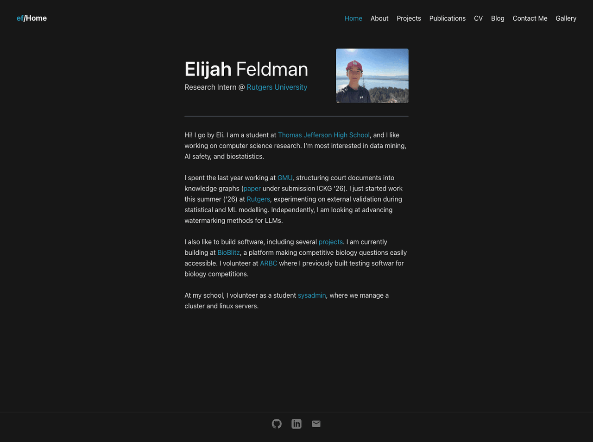

The home page is intentionally narrower and vertically centered instead of using the full width like the rest of the site, since my hope was to render it best on the screen of phones. I designed most of the site with smaller screens in mind, and this page especially so since it's the first thing anyone sees.

### About
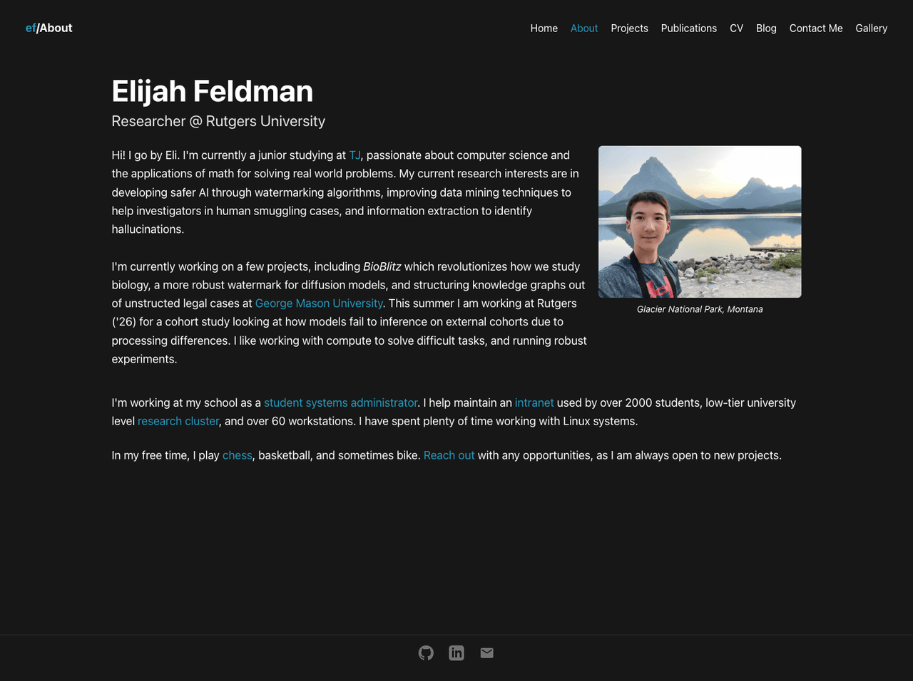

The fuller version of the bio on the home page, with a bigger photo and more detail on what I'm working on and where. Socials (Github, LinkedIn, email) live in the footer across every page, rendered as icons.

### Projects
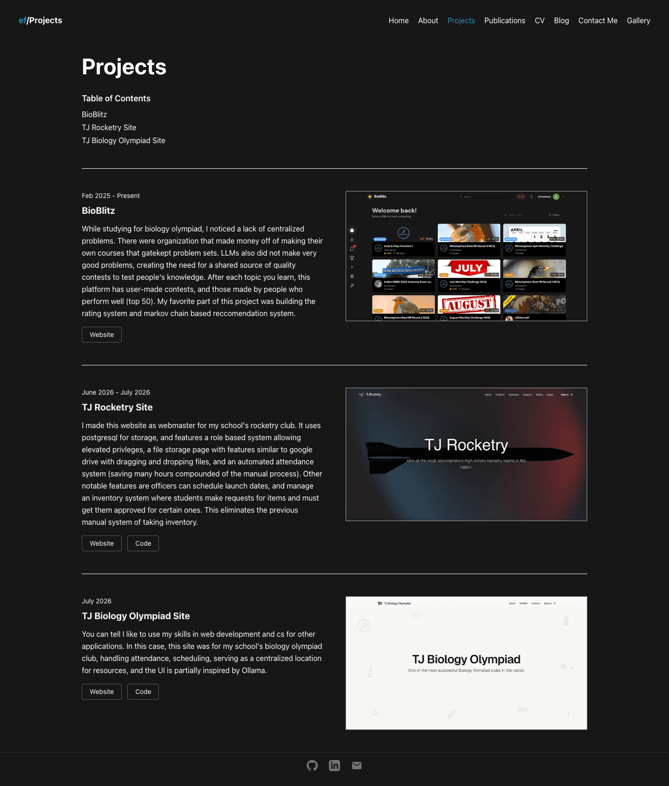

I wanted to ensure that the site would be easy to add to in the future, so the projects page now pulls automatically from a JSON file. Each entry specifies a title, date, description, image path, and a `links` array where I just specify a tag name (Website, Code, whatever) and a URL, and it renders in a unified button format. These are autopopulated with reference ids and go into the table of contents at the top automatically, so adding a new project is just adding a JSON entry, nothing else.

### Publications
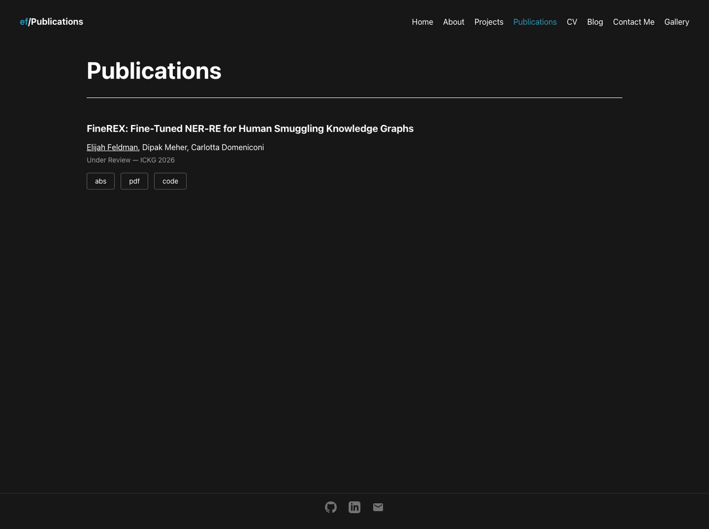

Same JSON-driven pattern as projects. It shows my paper's title, authors (my own name auto-bolded by matching against a constant, so I don't have to remember to do it by hand), venue/status and year, and the same flexible tag+link buttons (abs/pdf/code) as projects.

### CV
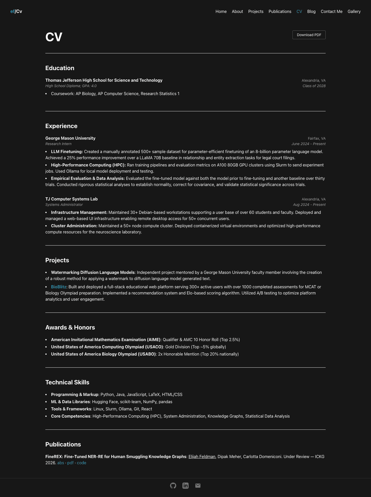

The CV is taken from LaTeX code from my resume, restructured into a JSON format so it renders natively on the site instead of embedding a PDF. It has a "Download PDF" button that links to the actual compiled PDF from that same LaTeX source, so both versions stay in sync. The Publications section at the bottom pulls from the exact same JSON file the Publications page uses, so I only ever have to add a new paper in one place.

### Blog
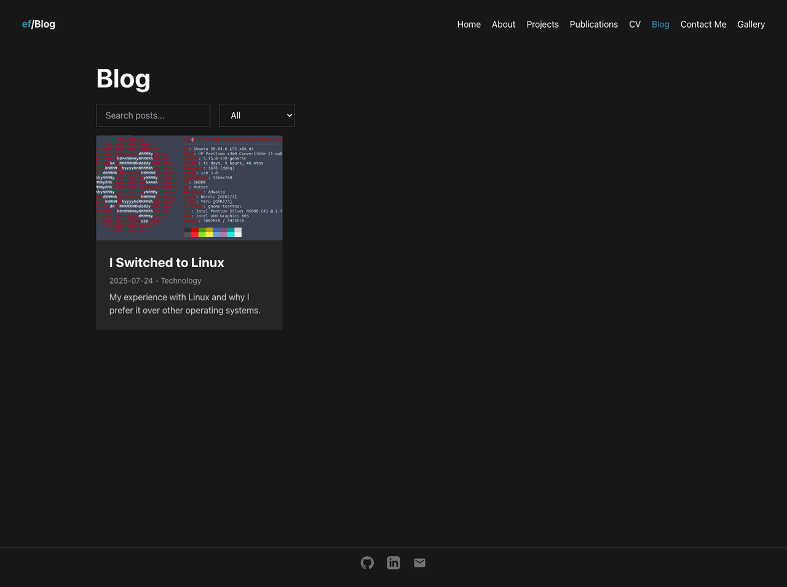
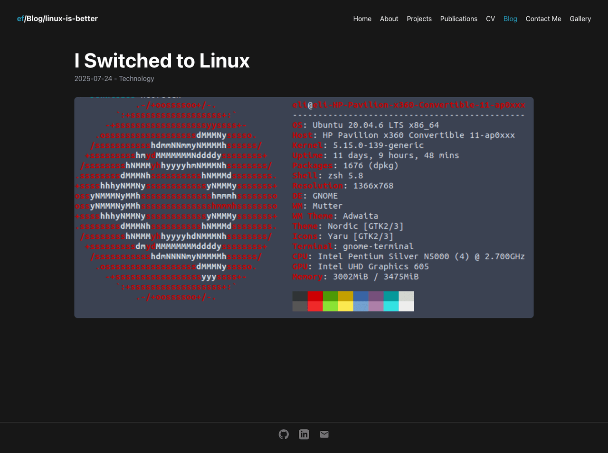

Search and topic filtering over a list of posts defined in `blog-posts.js`. Each post's actual content is a static HTML file fetched at `/blog/:uid`, so writing a post is dropping in an HTML file and a metadata entry, not writing more React.

### Gallery
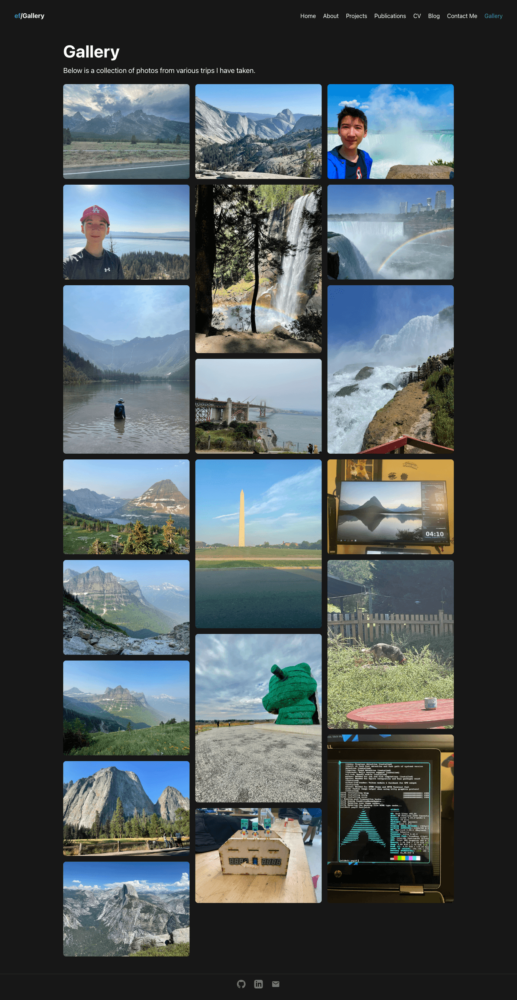
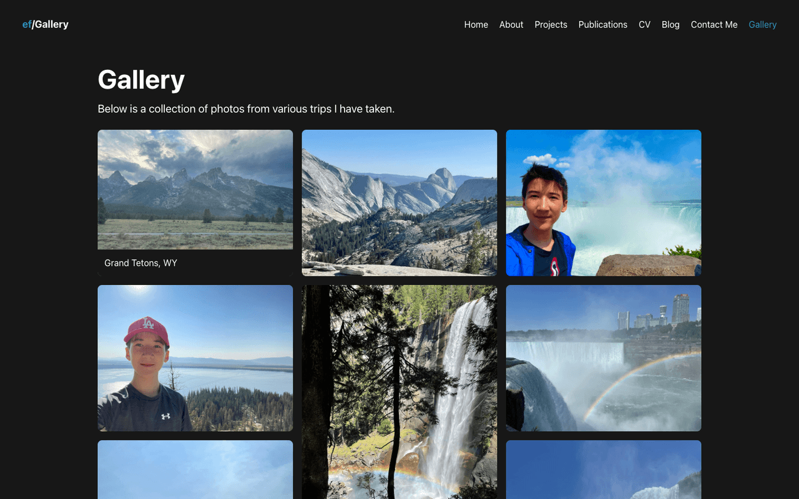

An indexed gallery system that tiles a group of photos and displays them in a masonry layout. Hovering a photo reveals its caption sliding up from the bottom. The gallery is much nicer now and loads quickly, since I wrote a JS script (`scripts/compress-images.js`) to go through each image and compress it — this took the site's images from 40MB down to about 4MB, meaning the page loads much, much faster. The two photos that are actually portraits of me are compressed less aggressively than the rest so they stay sharp, since those are the ones I want Google to associate with my name.

### Contact
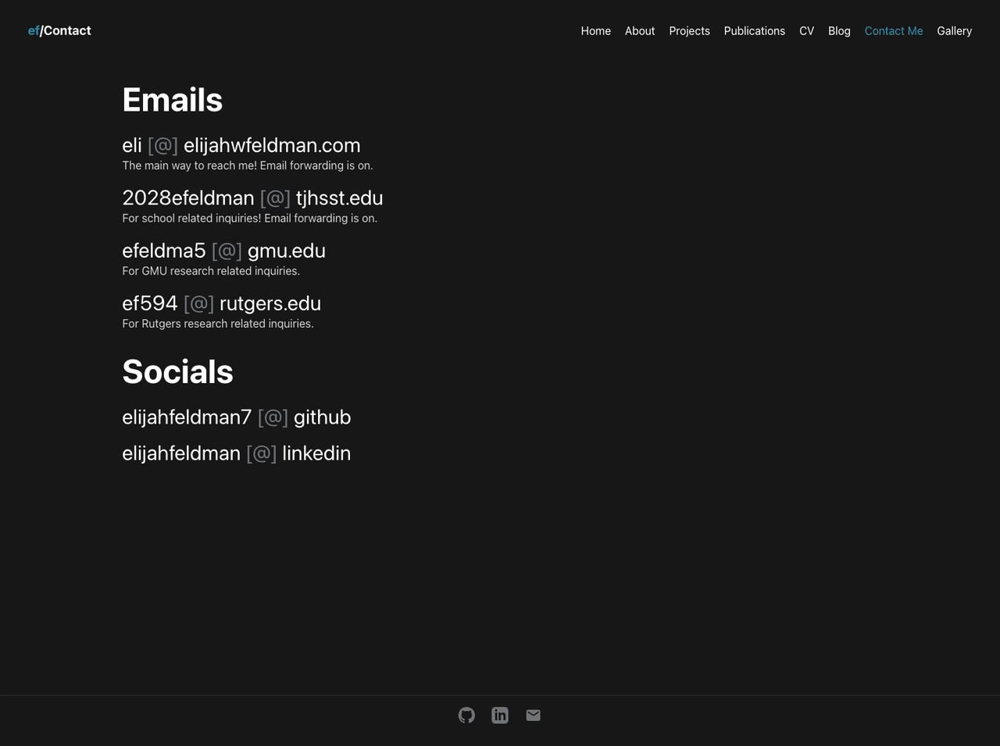

Emails and socials, written with `[@]` instead of `@` to dodge the most basic scrapers.

### Navbar & mobile menu
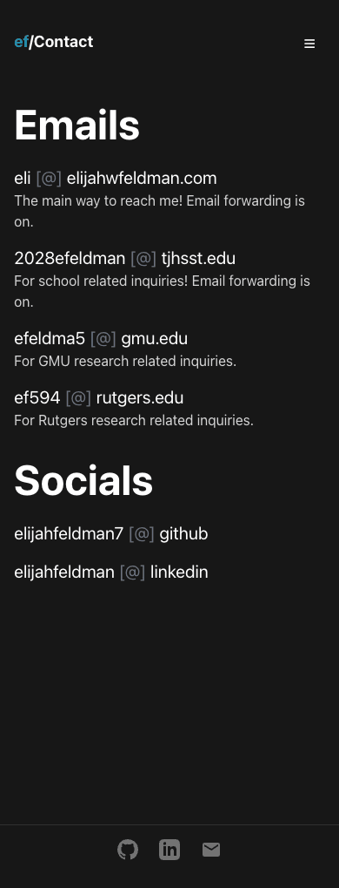
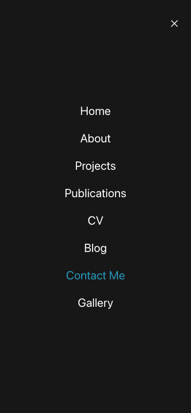

On the top left of the navbar, it dynamically renders the current page name based on the URL. On small screens the links collapse into a single hamburger button that opens a full-screen menu — same button toggles both states so it never jumps position when you open/close it. All pages are now fit well for small or medium screens using different Tailwind class names per breakpoint.

## Scripts

- `npm start` / `npm run build` — standard CRA scripts
- `npm run compress-images` — walks `public/`, resizes and recompresses every JPG/PNG. Portrait photos and icons get gentler settings than everything else; see the comment block at the top of `scripts/compress-images.js` for the exact tiers.

## Project structure

```
public/
  icons/       favicons, apple-touch-icon, android-chrome, PWA logos
  images/      site images (portraits, project covers, og:image preview)
  gallery/     photo gallery source images
  blog/        static HTML content for each blog post
  documents/   compiled resume PDF
  vendor/      third-party scripts (three.js)
src/
  pages/       one component per route
  components/  NavBar, Footer, ProgressBar
  *-data.json  content for Projects, Publications, CV, Gallery, Blog
resume/        LaTeX source for the CV/resume PDF
scripts/       compress-images.js, screenshot-site.js
```

---

## Devlog

 Devlog II: Personal Portfolio

The devlog today showcases in a sense more of a refinement with several large QOL updates, along with 2 more pages.

Firstly, I optimized the site for mobile. All pages are now fit well for small or md screens by using different tailwind classnames for different screens.

Second of all, the gallery is much nicer now and loads quickly, since I wrote a js script to go through each image and compress them. This took them from 40 MB -> 4MB, meaning the page loads much much faster.

Next, I wanted to ensure that the site would be easy to add to in the future, so the projects page now pulls automatically from a JSON file. It can have tags for links that render in a unified format and I specify file path, description, title. These are autopopulated with reference ids and go to the table of contents automatically.

I added a publications page to showcase my last paper, and those in the future to come. The CV is taken from latex code from my resume and is just a JSON structured format. It has the option to download the latex pdf too.

 Devlog I - Personal Website

For a bit of context, I worked on this site earlier however before it was pretty scattered without a gallery, projects, and mostly just had the home page with a weird VantaJS background. I apoligize for not dev logging over the past 7 hours, since I got so caught up in dev work.

For a brief overview, several features I built were:

    an indexed gallery system that would automatically tile a group of photos in a folder and display them. it would take the name of the photo and split it by _. for each member in the array, it would append it with spaces to become a string making the name of teh place that can be hovered over.
    On the top left of the navbar, it’ll dynamically render the url based on what page you are on
    The home page is smaller since my hope was to render it best on the screen of phones. I designed most of the site with smaller screens in mind
    For projects, I rendered a table of contexts that will jump to projects/#project based on the selected one, automatically going to that index of the page. I linked the code to previous project, bioblitz, however I still need to add more.
    I put the site on google search console with a sitemap so it will soon be indexed.

Overall, I really love the theme of this site, with the blue accents. I got some inspiration from other research portfolios. In the future, I want to redo the blog page fully since it didn’t have much before but one not dynamically rendered post. Attached are some photos of the pages.
